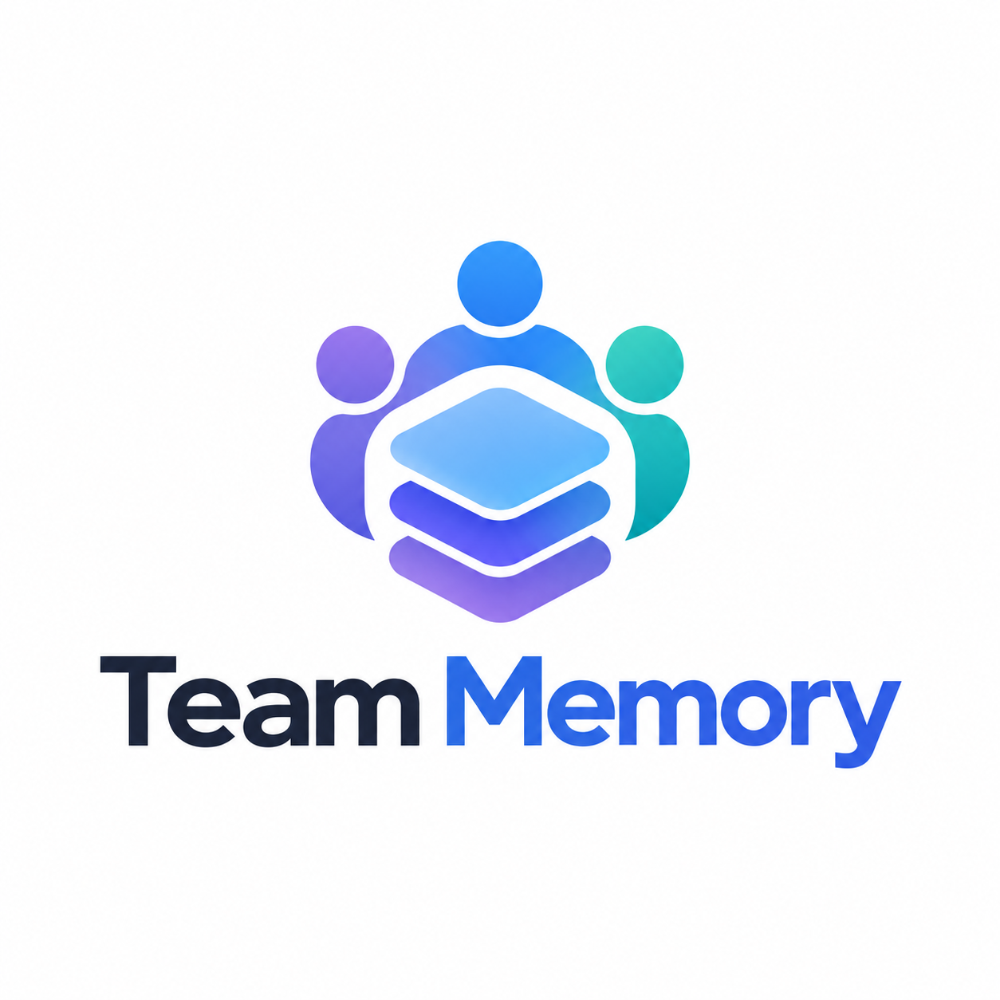

<p align="center">
  
</p>

<h3 align="center">Your repo remembers. So does Claude.</h3>

<p align="center">
  Local-first team memory for software repositories, and a
  <a href="packages/claude-plugin/README.md">Claude Code plugin</a> that reads it first and
  keeps it current.
</p>

---

Canonical memory is plain Markdown with YAML frontmatter, committed to the repo
under `.memory/`. Everything else — indexes, graphs, caches — is a disposable
projection that can be deleted and rebuilt byte-for-byte:

```bash
rm -rf .memory/.index
memory rebuild
```

A repo-defined ontology at `.memory/entities.yaml` says what resource types and
relationships mean. Humans and agents edit the same files.

## Install

```bash
pnpm add -D @team-memory/cli
```

## Use

```bash
memory init                 # scaffold .memory.yaml, .memory/ and the default ontology
memory validate             # check files against the ontology
memory validate --strict    # unresolved links become errors
memory sync                 # project changed files into .memory/.index
memory rebuild              # reset and reproject everything
memory watch                # reconcile continuously as files change
memory ontology list        # what resource types and relationships exist
memory ontology show service
```

## A memory file

```markdown
---
id: service.conversation-api
type: service
title: Conversation API

attributes:
  language: typescript
  lifecycle: active

links:
  - rel: owned_by
    target: team.platform

  - rel: depends_on
    target: datasource.sessions
    attributes:
      criticality: high
      runtime: true
---

# Conversation API

Handles conversation persistence and retrieval.
```

`id` is `<type>.<semantic-name>` and never depends on the file's path — moving
the file does not change what it identifies. Only `id`, `type` and `title` are
required.

## How it fits together

```
ontology + canonical files
          │ authoritative
          ▼
    reconciliation
          ▼
      projections
   disposable / rebuildable
```

The filesystem is the durable memory protocol. The ontology defines what
structured knowledge means. The watcher turns file changes into normalized
resource changes. Projections provide query capability, and nothing in them is
a source of truth.

Links may point at resources that do not exist yet — the graph is expected to
be built incrementally, so a dangling reference is a warning until you ask for
`--strict`.

## Projections

The Markdown files are the source. A projection is a destination: sync and
watch push every change into each projection listed in `.memory.yaml`.

```
.memory/**/*.md ──► memory sync / watch ──┬──► jsonl → .memory/.index/*.jsonl
                                          └──► mem0  → hosted or self-hosted mem0
```

**`jsonl`** writes `documents.jsonl`, `nodes.jsonl` and `edges.jsonl` — a
readable view of exactly what projections receive. Output is deterministic, so
rebuilds are byte-identical and diffable. (`type: file` is still accepted.)

**`mem0`** stores each document as one verbatim memory (`infer: false`): the
title, type, id, body, links and tags as text; the id, type, path, hash, tags
and provenance as metadata. Rebuilds reproduce it exactly and cost no LLM
calls. Documents with `index.vector: false` are left out. It needs the optional
`mem0ai` package (`pnpm add mem0ai`).

```yaml
projections:
  # Hosted mem0. The key comes from the environment, never the file.
  - type: mem0
    mode: platform
    apiKeyEnv: MEM0_API_KEY   # default
    # host: https://api.mem0.ai

  # Or self-hosted. `config` goes to mem0's `Memory` constructor untouched,
  # so any embedder, vector store or LLM mem0 supports works.
  - type: mem0
    mode: oss
    config:
      embedder: { provider: ollama, config: { model: nomic-embed-text } }
      vectorStore: { provider: qdrant, config: { host: localhost, port: 6333 } }
      llm: { provider: ollama, config: { model: "qwen2.5:7b" } }
```

Both modes file memories under one scope, by default
`agentId: team-memory-<repo directory>`. Set `scope:` (`userId`, `agentId`
and/or `runId`) to choose your own. `memory rebuild` deletes and repopulates the
whole scope, so do not share it with memories written by anything else. Set
`MEM0_TELEMETRY=false` to turn off the mem0 SDK's telemetry.

The manifest that makes sync skip unchanged files lives in `state.dir`
(default `.memory/.index`), independent of any projection. Adding, removing or
reconfiguring a projection makes the next sync reproject everything, so a newly
added mem0 receives the whole repository.

Graph and full-text projections are not built yet; the `MemoryProjection`
interface is where they plug in.

## Claude Code plugin

`packages/claude-plugin/` contains skills and hooks that let Claude capture
durable project knowledge by editing the same canonical files a human would.
Agents never write to an index. See its
[README](packages/claude-plugin/README.md).

## Development

```bash
pnpm install
pnpm typecheck
pnpm test
pnpm build
```

Layout, phases and track ownership are in [`PLAN.md`](PLAN.md). The full
specification is [`docs/SPEC.md`](docs/SPEC.md).
