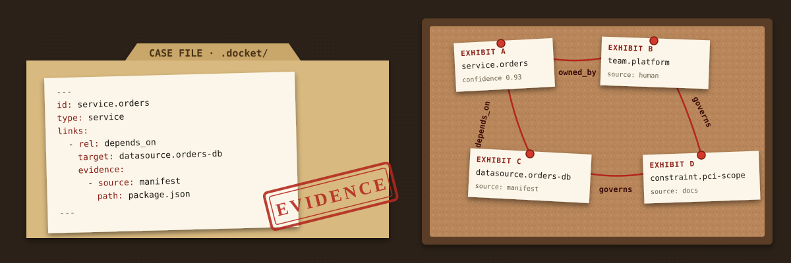
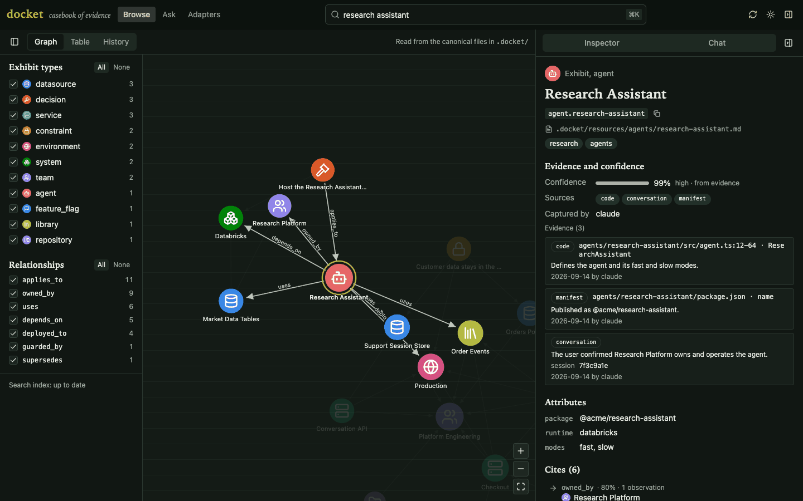

<p align="center">
  
</p>

<h1 align="center">docket</h1>

<h3 align="center">The casebook of evidence for your repository.</h3>

<p align="center">
  Every claim about your system, entered as an exhibit and cited to its source,
  kept in the repo, and a
  <a href="packages/claude-plugin/README.md">Claude Code plugin</a> that reads the
  case file first and enters new evidence as it works.
</p>

<p align="center">
  <a href="#the-case-file">The case file</a> ·
  <a href="#an-exhibit">An exhibit</a> ·
  <a href="#how-to-use-it">How to use it</a> ·
  <a href="#install">Install</a> ·
  <a href="#browse-it-docket-open">Browse it</a>
</p>

---

Which services exist, who owns them, what depends on what, why the datastore
decision went the way it did: that knowledge is usually hearsay, scattered
across people's heads, stale wikis and chat threads. docket keeps it on the
record. Each fact is an **exhibit**, a plain Markdown file with YAML
frontmatter under `.docket/`, and each claim in it cites its **evidence**:
the file and lines, manifest key, endpoint, URL or conversation it was seen in.
docket weighs that evidence into a confidence score; nobody writes one by hand.

The files are the record. Indexes, vector stores and graphs are disposable
projections of them, deleted and rebuilt byte-for-byte whenever you like:

```bash
rm -rf .docket/.index
docket rebuild
```

## The case file

`docket init` opens the case: a config file at the root and a `.docket/` tree
beside your code. Humans and agents edit the same files, and Git keeps the
history.

```text
your-repo/
├── .docket.yaml               config: where the case file lives, which projections to feed
└── .docket/
    ├── entities.yaml          the ontology: resource types, relationships, evidence sources
    ├── resources/             exhibits, one Markdown file per thing
    │   ├── services/orders.md         id: service.orders
    │   ├── teams/platform-engineering.md
    │   ├── datasources/orders-db.md
    │   └── ...                repositories, libraries, agents, systems, environments
    ├── decisions/             why things are the way they are, losers included
    │   └── orders-on-postgres.md
    ├── constraints/           rules the system must obey
    │   └── pci-scope.md
    ├── notes/                 anything else worth keeping
    ├── .index/                projections: generated, gitignored, disposable
    │   ├── documents.jsonl
    │   ├── nodes.jsonl
    │   ├── edges.jsonl
    │   └── manifest.json
    └── .cache/                answers docket open's chat cached: gitignored, disposable
```

Directories are only for people: an exhibit's identity is the `id` in its
frontmatter, never its path, so files can move freely. The ontology in
`entities.yaml` is per-repository. It starts as the default SDLC ontology
(services, APIs, pipelines, clusters, incidents, runbooks, policies, teams,
decisions, constraints and more) and you extend it when your case needs a type
it does not have. [`examples/acme-platform`](examples/acme-platform) is a
complete worked case file: 21 resources and 37 links.

## An exhibit

```markdown
---
id: service.conversation-api          # <type>.<semantic-name>; never changes when the file moves
type: service                         # a resource type from entities.yaml
title: Conversation API

attributes:
  language: typescript
  lifecycle: active

links:                                # typed relationships to other exhibits
  - rel: owned_by
    target: team.platform

  - rel: depends_on
    target: datasource.sessions
    attributes:
      criticality: high
      runtime: true
    evidence:                         # where this link was seen
      - source: code
        path: src/store/sessions.ts
        lines: 12-40
        observedAt: 2026-10-05
        observedBy: claude

evidence:                             # where the service itself was seen
  - source: manifest
    path: services/conversation-api/package.json
    key: name
    observedAt: 2026-10-05
    observedBy: claude
---

# Conversation API

Handles conversation persistence and retrieval.
```

Only `id`, `type` and `title` are required. Links may point at exhibits no
file defines yet: the graph is built incrementally, so a dangling reference is
a warning until you ask for `--strict`. See
[Evidence and confidence](#evidence-and-confidence) for how evidence becomes a
score.

## How to use it

**1. Open the case.** From the root of your repository:

```bash
npx @chrisjowen/docket setup
```

This installs the Claude Code plugin, offers to run `docket init` to create
`.docket.yaml`, `.docket/` and the default ontology, and offers to install the
`docket` CLI globally. Restart Claude Code to load the plugin.
[Install](#install) covers teams, CI and doing it by hand.

**2. Enter evidence.** Ask Claude to "remember" a fact, decision or constraint,
or let it notice one: the plugin's `remember` skill writes the exhibit and cites
where it saw it, and an end-of-session review captures what a session settled.
You can write or edit exhibits by hand just as well. Either way, check them
against the ontology:

```bash
docket validate --strict
```

**3. Index the record.** Projections are what make the case file searchable:

```bash
docket sync         # project changed files into .docket/.index (and mem0 or Neo4j, if configured)
docket watch        # or keep projecting continuously as files change
docket rebuild      # throw every projection away and rebuild it from the files
```

**4. Question the witness.** Search every projection at once; each hit points
at its canonical file:

```bash
docket search who owns checkout
docket ontology show service    # a service's attributes, links and what each source is worth
```

The plugin teaches Claude to ask the docket before it greps the code.

**5. Review the case.** `docket open` serves a web UI to browse the graph, read
each exhibit with its evidence and confidence, and ask questions. See
[Browse it](#browse-it-docket-open).

## Install

One command, from the root of the repository you want to remember things:

```bash
npx @chrisjowen/docket setup
```

It installs the Claude Code plugin (through the `claude` CLI, for your user),
offers to run `docket init` if the repository has no `.docket.yaml`, and offers
to install the CLI globally so `docket` works in your shell too. Run it again
whenever you like: it updates what is already installed and leaves an existing
`.docket.yaml` alone. Restart Claude Code afterwards to load the plugin.

Without a terminal (CI, scripts) it asks nothing: it installs the plugin and
skips the rest unless told otherwise. `--yes` takes the recommended answer to
every question (set up the repository, but no global install), `--no-init`
and `--no-global` skip those offers, and `--global` installs the CLI without
asking. Node 22 or later.

### For a team

```bash
npx @chrisjowen/docket setup --team
```

installs the plugin for the repository instead of for you: it records the
marketplace and the plugin in `.claude/settings.json`. Commit that file, and
everyone who clones the repository and trusts it in Claude Code is offered the
plugin.

### Just the plugin

Without the `claude` CLI on your path, or to do it by hand, install the plugin
from inside Claude Code:

```text
/plugin marketplace add chrisjowen/docket
/plugin install docket@docket
```

The plugin needs no separate CLI install. It runs the repository's own
`docket`, or one on your path, and otherwise the CLI release it pins, through
`npx` (so Node 22 or later is still needed). Set up a repository with
`npx @chrisjowen/docket init`.

### As a dev dependency

```bash
pnpm add -D @chrisjowen/docket   # or: npm install --save-dev @chrisjowen/docket
npx docket init
```

The command is `docket`; run it through `npx` (or a `package.json` script) when
it is installed as a dev dependency. The plugin uses this copy first.

## Command reference

```bash
docket setup                # install the Claude Code plugin and set up this repository
docket init                 # scaffold .docket.yaml, .docket/ and the default ontology
docket validate             # check files against the ontology
docket validate --strict    # unresolved links become errors
docket sync                 # project changed files into .docket/.index
docket rebuild              # reset and reproject everything
docket watch                # reconcile continuously as files change
docket search <query...>    # ask every projection that can search
docket open                 # browse, search, ask and chat in a web UI, served on all interfaces
docket ontology list        # resource types, relationships and evidence sources
docket ontology show service  # attributes, relationships and confidence by source
```

## Browse it: `docket open`

<p align="center">
  
</p>

`docket open` serves a web UI for the repository on port 4380 and prints
`http://127.0.0.1:4380/` (or any free port when that one is taken; `--port`
picks one, `--no-open` skips launching the browser). It reads the canonical
files on every request, so it needs no projection beyond the default `jsonl`.
It listens on all interfaces (`0.0.0.0`) and answers any Host, so anyone who
can reach the machine on that port can read the repository's knowledge. The
API never changes the canonical files; its one write is chat's answer cache.

- **Graph** - every entity and relationship as a force-directed graph, each
  type drawn with its own icon and colour, filtered by type and relationship
  (each with All / None switches). Links to entities no file defines yet
  show as dashed ghosts.
- **Details** - an entity's frontmatter, notes and links in and out, with the
  confidence docket computes for it and for each link, the sources that
  corroborate it, and every piece of evidence - file and lines, endpoint,
  URLs, when and by whom - merged from all the files that declare its id.
  Each link expands to show the evidence for that relationship.
- **Quick search** (`⌘K` or `/`) - instant type-ahead over ids, titles, types,
  tags, attributes, notes and relationship names. `type:service`,
  `rel:depends_on` and `tag:core` narrow it down; picking a result focuses
  the graph on it.
- **Ask** - a question answered by `docket search`, the same search agents
  use, with the relationship paths that join what it found. The graph then
  shows only the entities the answer cites until you show everything again.
  It answers from the projections, so run `docket sync` first; the UI says
  when the index is behind the files.
- **Chat** - a conversation with the casebook. Each question runs the same
  search as Ask, then a model summarizes what it found in a few sentences,
  citing each exhibit it relies on; citations link to the exhibit, and the
  graph shows only the exhibits cited (everything found when it cites none).
  The model is Claude, through the `claude` CLI from
  [Claude Code](https://claude.com/claude-code) - nothing to configure, it uses
  your own login. docket runs it in print mode (`claude -p`) with the
  question on stdin, no tools, no MCP servers and no saved session, and gives
  up after two minutes. To pick its model, or to summarize with a local
  Ollama model instead, set `summarize` in `.docket.yaml`:

  ```yaml
  summarize:
    provider: claude
    model: sonnet                      # passed as `claude --model`; unset, Claude Code picks
    # timeoutMs: 120000
  ```

  ```yaml
  summarize:
    model: "qwen2.5:7b"                # Ollama at http://localhost:11434
    # provider: ollama                 # the default when `provider` is left out
    # url: http://localhost:11434
    # timeoutMs: 60000
  ```

  When `claude` is not installed and no Ollama model is set - or when the
  model fails - chat shows what search found, unsummarized, and says why.

  Summaries are cached in `.docket/.cache/chat/`, one JSON file per question,
  keyed by a hash of the question (ignoring case and spacing), the model and
  its provider, its instructions, the content hash of every exhibit the
  summary was built from and the relationship paths connecting them. Asking
  the same question again returns the cached answer at once, marked as such,
  while those are unchanged; editing any file that declares one of the
  exhibits, finding a different set, a change in how they connect, or
  changing the model or provider asks the model afresh and replaces the entry.
  Like `.index`, the cache is disposable: `docket init` adds `.docket/.cache/`
  to `.gitignore`, and deleting it only costs the next answer a model call.

The UI is a SvelteKit app in [`packages/docket-ui`](packages/docket-ui),
built into the npm package, so `npm i -g @chrisjowen/docket` is all it needs.

## Evidence and confidence

A captured resource or link says exactly where it was seen, as `evidence`: a
source kind and the location — file, line range and symbol; config key; API
method and endpoint; URL — with when, by whom and in which session.

```yaml
evidence:
  - source: infrastructure
    path: deploy/k8s/orders/deployment.yaml
    lines: 1-48
    symbol: Deployment/orders-api
    urls:
      - https://github.com/acme/platform/blob/3f2c1d0/deploy/k8s/orders/deployment.yaml#L1-L48
    observedAt: 2026-10-05
    observedBy: claude
    session: 6c1f0e2a
    note: Deployment with 3 replicas of the orders-api image.
```

Links take an `evidence` list of their own. Evidence is append-only: seeing
something again adds an entry and never rewrites an earlier one.

Confidence is computed, never written. The ontology says what one observation
from each source is worth, per resource type and relationship — a dependency
declared in a manifest is close to certain, a pod or secret named in code is
not much until something independent confirms it:

```yaml
# .docket/entities.yaml
evidence:
  sources:
    code: { confidence: 0.6, requires: [path] }
    runtime: { confidence: 0.85, requiresAny: [urls, endpoint, symbol] }

resourceTypes:
  pod:
    confidence: { code: 0.3, infrastructure: 0.7, runtime: 0.9 }

relationships:
  depends_on:
    confidence: { manifest: 0.95, code: 0.65 }
```

Observations of one source kind do not corroborate each other — the strongest
counts — while independent kinds combine as `1 - (1 - a)(1 - b)`: a pod read
from code (0.3) and seen running (0.9) is 0.93. A resource with no evidence
takes its `provenance.confidence`, or `evidence.unevidenced` (0.5). The
default ontology ships the source kinds `code`, `manifest`, `config`,
`infrastructure`, `api`, `runtime`, `docs`, `conversation` and `human`, and
rules for the types where it matters; an ontology written before evidence
existed gets the same defaults. `docket ontology show <type>` prints the
confidence each source earns for that type, and `docket validate` rejects
evidence that does not give the location its source requires.

Several files may declare the same `id` — two branches capturing the same
service, say. They are one resource: projections receive a single merged
entity with every file's evidence, one relationship per (source, rel, target),
and the confidence the combined evidence earns. The first file by path names
it and its attribute values stand; a file that disagrees gets a warning, and
one that gives the id another type is left out with an error.

## How it fits together

```
ontology + canonical files
          │ authoritative
          ▼
    reconciliation
          ▼
      projections
   disposable / rebuildable
```

The filesystem is the durable memory protocol. The ontology defines what
structured knowledge means. The watcher turns file changes into normalized
resource changes. Projections provide query capability, and nothing in them is
a source of truth.

Links may point at resources that do not exist yet — the graph is expected to
be built incrementally, so a dangling reference is a warning until you ask for
`--strict`.

## Projections

The Markdown files are the source. A projection is a destination: sync and
watch push every change into each projection listed in `.docket.yaml`.

```
.docket/**/*.md ──► docket sync / watch ──┬──► jsonl  → .docket/.index/*.jsonl
                                          ├──► mem0   → hosted or self-hosted mem0
                                          └──► neo4j  → a Neo4j graph
```

Every projection receives merged entities — one per id, however many files
declare it — each resource and link carrying its evidence, evidence count,
corroborating source kinds and confidence.

**`jsonl`** writes `documents.jsonl`, `nodes.jsonl` and `edges.jsonl` — a
readable view of exactly what projections receive. Output is deterministic, so
rebuilds are byte-identical and diffable. (`type: file` is still accepted.)
It is the default, and the only projection `docket search` has out of the box:
a lexical keyword search over titles, ids, tags and bodies.

**`mem0`** stores each resource as one verbatim memory (`infer: false`): the
title, type, id, confidence, body, links, evidence and tags as text; the id,
type, paths, hash, tags, confidence and evidence count as metadata. Rebuilds
reproduce it exactly and cost no LLM calls. Documents with
`index.vector: false` are left out. It needs the optional `mem0ai` package
(`pnpm add mem0ai`).

```yaml
projections:
  # Hosted mem0. The key comes from the environment, never the file.
  - type: mem0
    mode: platform
    apiKeyEnv: MEM0_API_KEY   # default
    # host: https://api.mem0.ai

  # Or self-hosted. `config` goes to mem0's `Memory` constructor untouched,
  # so any embedder, vector store or LLM mem0 supports works.
  - type: mem0
    mode: oss
    config:
      embedder: { provider: ollama, config: { model: nomic-embed-text } }
      vectorStore: { provider: qdrant, config: { host: localhost, port: 6333 } }
      llm: { provider: ollama, config: { model: "qwen2.5:7b" } }
```

Both modes file memories under one scope, by default
`agentId: docket-<checkout directory>-<hash>`, where the hash is taken over the
checkout's absolute path (symlinks and letter case resolved). Two clones or
worktrees with the same directory name therefore never share a scope. Moving a
checkout to a new path starts a new scope and leaves the old remote one behind.
The path is the only input, so checkouts on different machines at the same path
(devcontainers, Codespaces, CI runners) get the same default scope: if they
point at one shared mem0 or Neo4j server, each must set `scope:` (`userId`,
`agentId` and/or `runId`) explicitly. Set `scope:` too to choose your own.
`docket rebuild` deletes and repopulates the whole scope, so do not share it
with memories written by anything else. The `neo4j` projection's
`scope` defaults the same way.

Scopes created by earlier versions (`team-memory-<directory>` in mem0, the bare
directory name in Neo4j) are left behind, not migrated or deleted: the first
`docket sync` projects everything into the new scope. Delete the old scope by
hand if you no longer want it, or set `scope:` to the old value to keep using
it. Set
`MEM0_TELEMETRY=false` to turn off the mem0 SDK's telemetry.

**`neo4j`** writes one `(:Memory:<Type>)` node per resource and one
relationship per (source, rel, target), with `confidence`, `evidenceCount`,
`sources` and `evidence` on both, so a query can ask for what rests on code
alone — and a full-text index over the documents. It needs the optional
`neo4j-driver` package and a running Neo4j server. `docket search` asks it with
a full-text query, or, with `cypher` set, has a local Ollama model write a
read-only Cypher query against the graph's schema (falling back to full-text
when that fails or finds nothing).

```yaml
projections:
  - type: neo4j
    url: bolt://localhost:7687        # default
    username: neo4j                   # default
    passwordEnv: NEO4J_PASSWORD       # unset: connect without auth
    # database: neo4j
    # cypher:
    #   model: "qwen2.5:7b"           # Ollama at http://localhost:11434
```

The manifest that makes sync skip unchanged resources lives in `state.dir`
(default `.docket/.index`), independent of any projection. A resource is
reprojected whenever what it projects changes — one of its files, or a
confidence rule in the ontology. Adding, removing or reconfiguring a projection
makes the next sync reproject everything, so a newly added mem0 receives the
whole repository.

New projections plug in through the `MemoryProjection` interface.

## Claude Code plugin

`packages/claude-plugin/` contains skills and hooks that let Claude capture
durable project knowledge by editing the same canonical files a human would.
Agents never write to an index. See its
[README](packages/claude-plugin/README.md).

## Development

```bash
pnpm install
pnpm typecheck   # sources and tests
pnpm build       # the web UI first, then docket, which ships a copy of it;
                 # the end-to-end tests run the built CLI, so build first
pnpm test        # the CLI's suite and the plugin's hook tests
```

To work on the web UI with hot reload, run `docket open --no-open` in a
repository with a `.docket/`, then `pnpm -C packages/docket-ui dev`; the dev
server proxies `/api` to it (set `DOCKET_API` if it is not on port 4380).

Layout, phases and track ownership are in [`PLAN.md`](PLAN.md). The full
specification is [`docs/SPEC.md`](docs/SPEC.md).

## Releasing

[`.github/workflows/publish.yml`](.github/workflows/publish.yml) stages
`@chrisjowen/docket` on npm, with provenance, when a `v<version>` tag is pushed
(or a GitHub release creates one). It typechecks, builds and tests first, and
refuses a tag that does not match `packages/docket/package.json`. npm does not
allow publishing from CI without 2FA, so the workflow runs `npm stage publish`:
the version lands in npm's staging area and goes live only once a maintainer
approves it.

1. Bump `version` in `packages/docket/package.json`, and `CLI_VERSION` in
   `packages/claude-plugin/scripts/cli.js` to match (the plugin's tests fail
   until they agree), and merge it.
2. Tag that commit `v<version>` and push the tag, or publish a GitHub release
   for it.
3. Approve the staged version with 2FA: `npm stage approve <stage-id>`, or the
   Staged Packages tab on npmjs.com.

The workflow authenticates with the `NPM_TOKEN` repository secret (an npm token
with publish rights to `@chrisjowen/docket`, already configured) and signs
provenance through GitHub's OIDC token. The first stage of a new package also
creates a public `0.0.0-stage` placeholder version on npm.

Check what a release will contain with `npm pack --dry-run` in
`packages/docket`.

---

<sub>The case-file illustration at the top, `docs/assets/docket-hero.svg`, is
original artwork drawn for this repository; it uses no third-party images. The
`docket open` screenshot shows the [`examples/acme-platform`](examples/acme-platform)
case file.</sub>
